# GamaParking

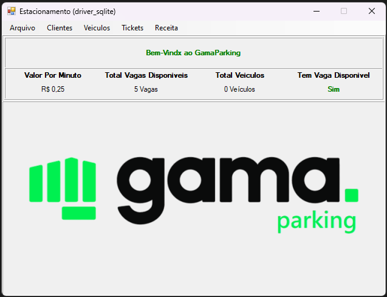

## Descrição

GamaParking é uma aplicação Windows Forms desenvolvida em .NET 4.5 que permite o gerenciamento de um estacionamento. O objetivo principal do projeto é realizar o cadastro e listagem de clientes, veículos, tickets de estacionamento, preços, controle de vagas e geração de relatórios de receita. Além disso, a aplicação oferece a possibilidade de armazenamento dos dados em diferentes formatos: SQLite, CSV, JSON e também em memória volátil, que apaga todos os dados ao reiniciar o aplicativo.

## Funcionalidades

A aplicação possui as seguintes funcionalidades:

- Cadastro de Clientes: Permite cadastrar novos clientes com informações como nome, CPF, telefone, e-mail, etc.   
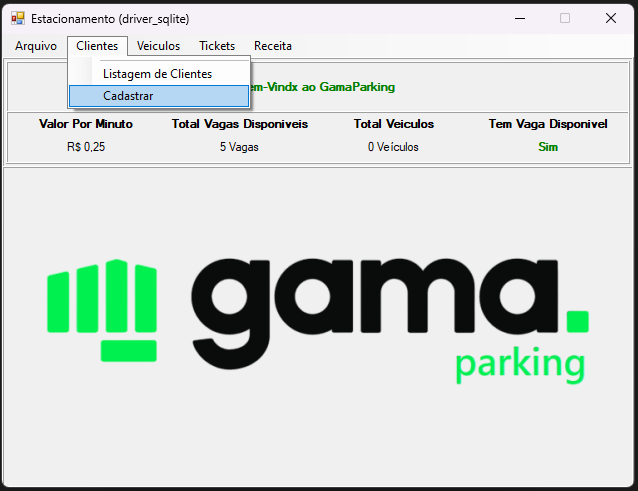
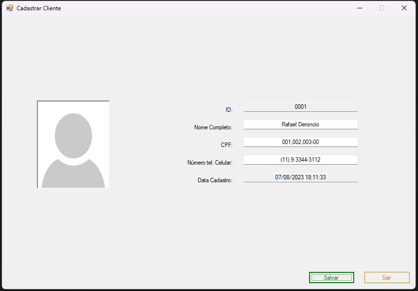   

- Listagem de Clientes: Exibe a lista de todos os clientes cadastrados no sistema.   
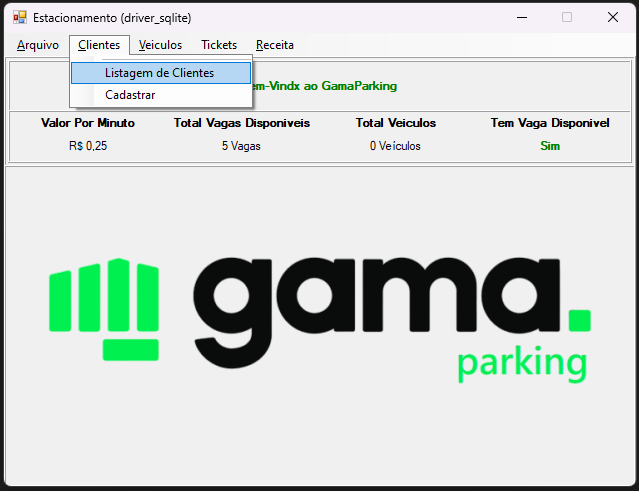
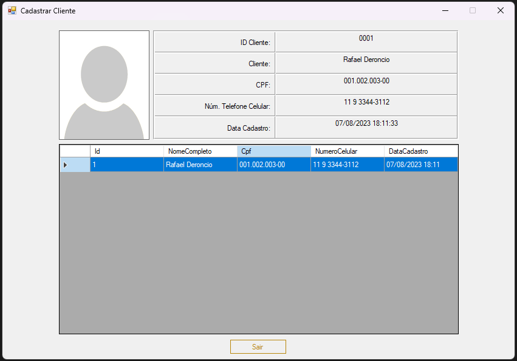   

- Cadastro de Veículos: Permite associar veículos aos clientes, informando modelo, placa e outras informações relevantes.   
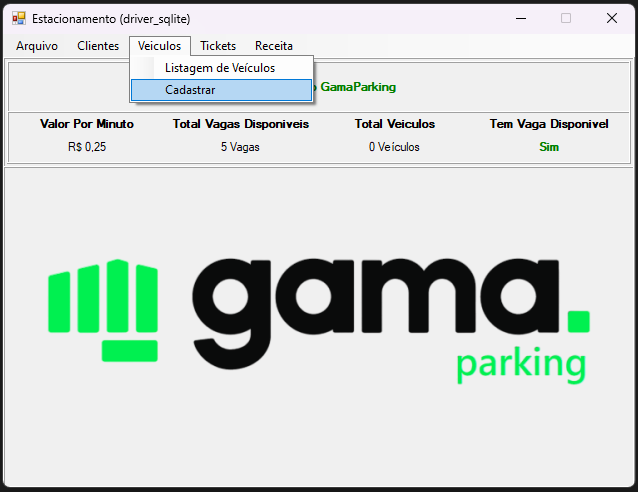
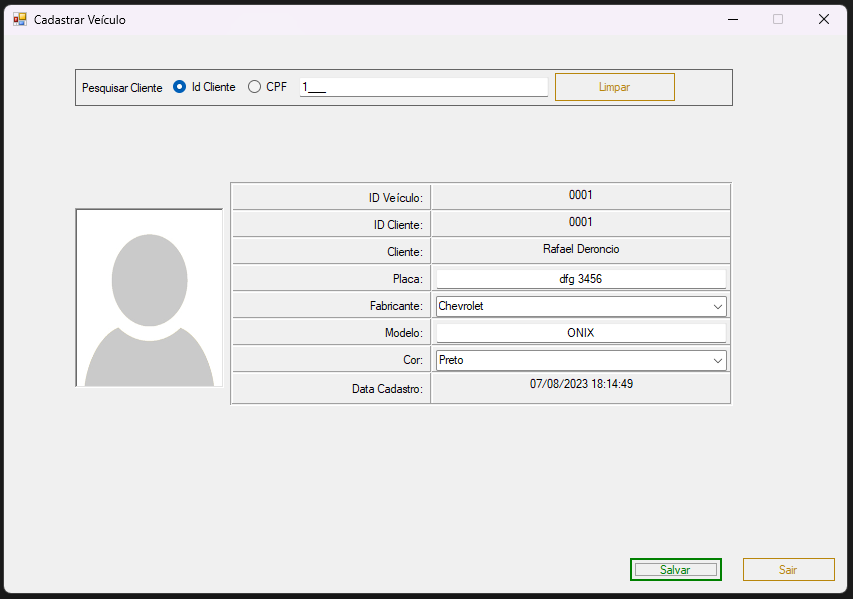   

- Listagem de Veículos: Exibe a lista de veículos cadastrados no sistema, incluindo informações do proprietário.   
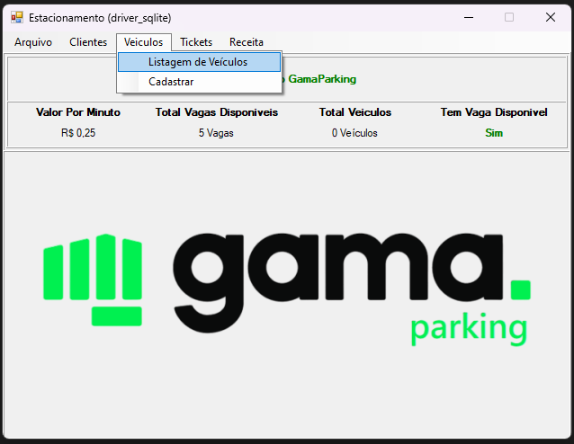
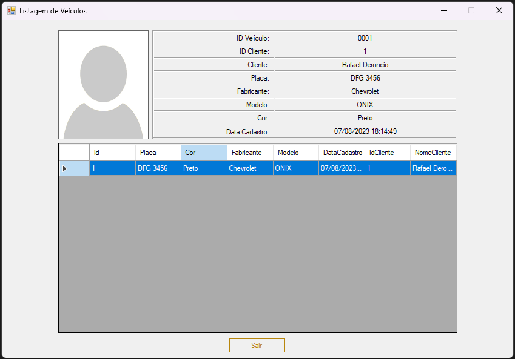   

- Cadastro de Tickets de Estacionamento: Permite registrar a entrada e saída de veículos no estacionamento, gerando um ticket com informações como data/hora de entrada, placa do veículo, e valor a ser cobrado.   
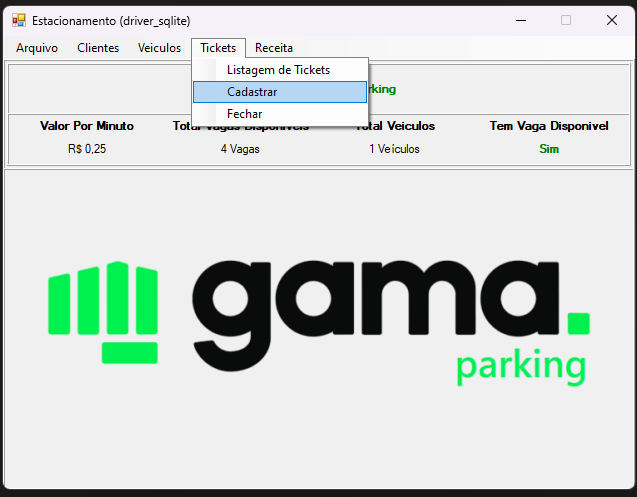
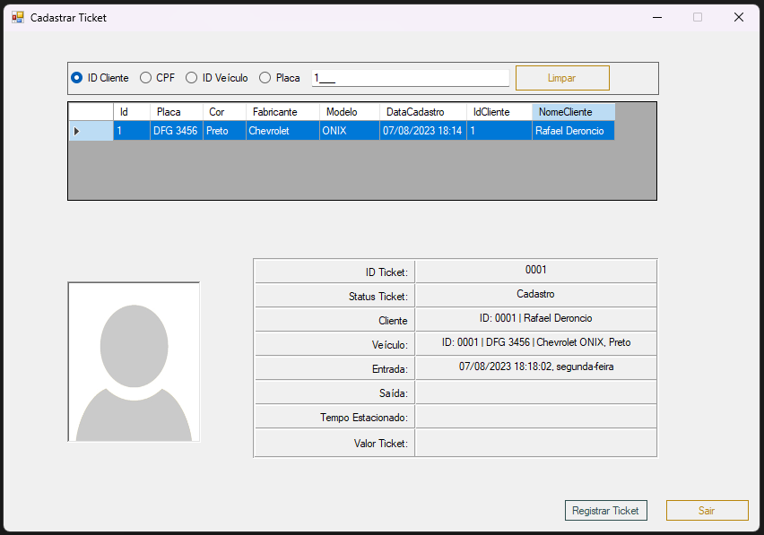   

- Cadastro de Preços: Permite definir os preços para o estacionamento com base em critérios como tempo de permanência, tipo de veículo, etc.   
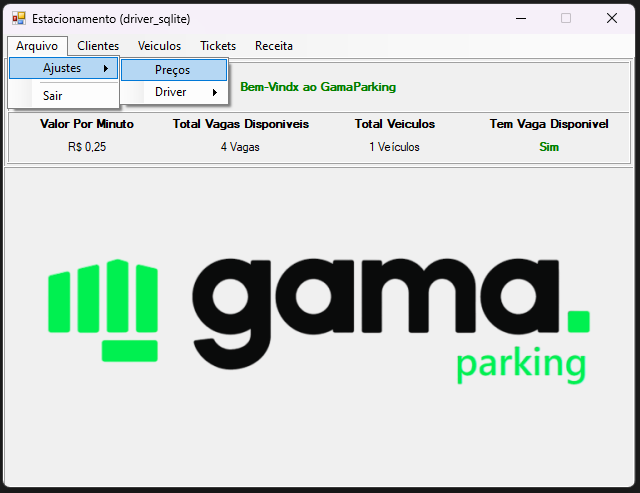
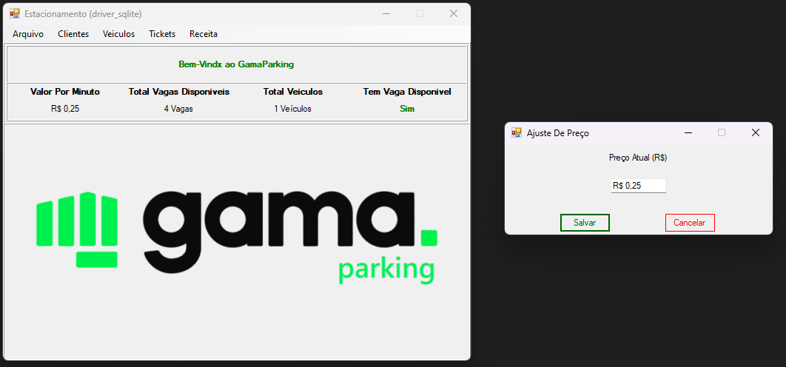   

- Controle de Vagas: Monitora as vagas de estacionamento disponíveis e indica quando estão ocupadas ou livres.   

- Relatórios de Receita: Gera relatórios com informações sobre a receita gerada pelo estacionamento em um determinado período.   
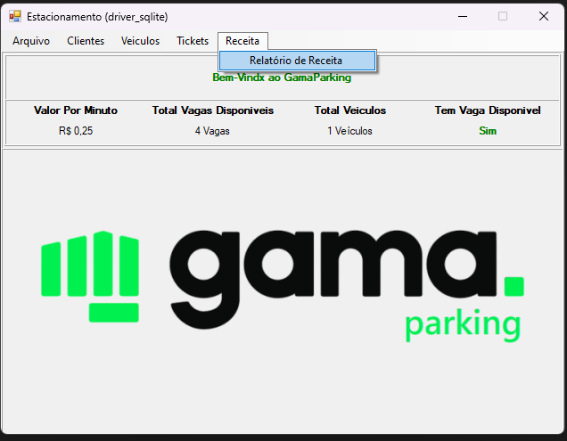
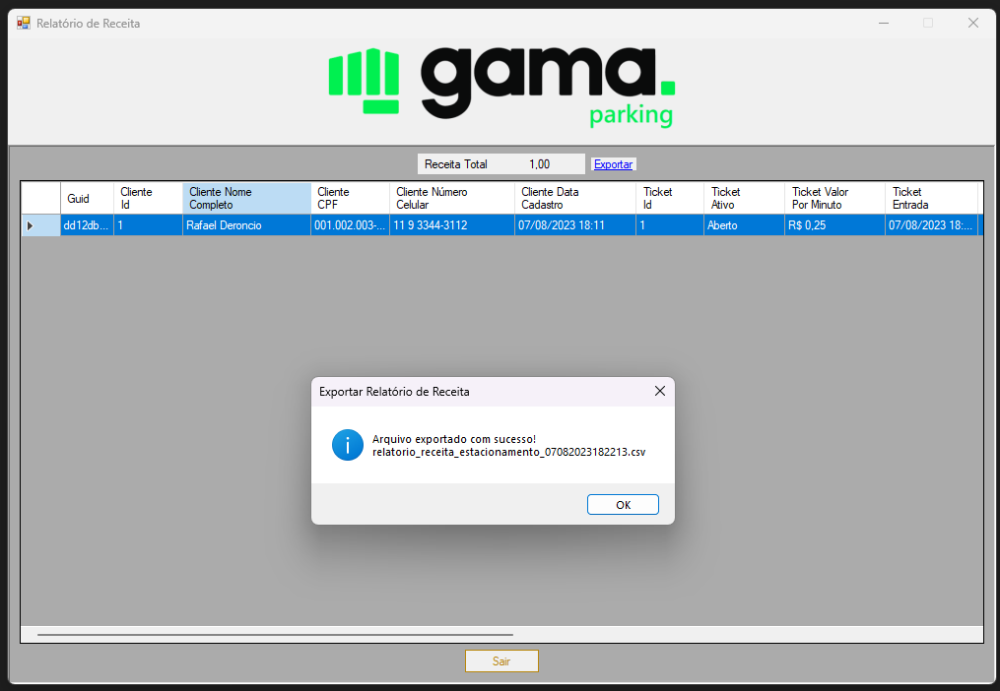   

## Armazenamento de Dados

A aplicação utiliza diferentes formas de armazenamento de dados:

1. Banco SQLite: Os dados são armazenados em um banco de dados SQLite, permitindo o acesso persistente mesmo após o fechamento do aplicativo.

2. CSV e JSON: Caso não exista um banco de dados SQLite, a aplicação cria arquivos em formato CSV e JSON para armazenar os dados, garantindo a portabilidade e facilidade de acesso aos dados em diferentes formatos.

3. Memória Volátil: O aplicativo também oferece a opção de armazenar os dados em memória volátil, ou seja, os dados são apagados ao reiniciar o aplicativo, sendo útil para fins de teste ou experimentação.

## Instalação e Uso

Para instalar e utilizar o projeto GamaParking, siga os passos abaixo:

### Pré-requisitos

Antes de prosseguir, verifique se o seu sistema atende aos seguintes requisitos:

- Sistema operacional Windows
- Microsoft .NET Framework 4.8 ou superior instalado

### Instalação

1. Clone ou faça o download do repositório do projeto GamaParking para o seu computador.
2. Abra o projeto no Visual Studio (ou outro IDE compatível com .NET).
3. Restaure os pacotes NuGet necessários para o projeto. No Visual Studio, clique com o botão direito no projeto GamaParking no Gerenciador de Soluções e selecione "Restaurar Pacotes NuGet".

### Configuração do Banco de Dados

O projeto GamaParking utiliza o banco de dados SQLite para armazenar os dados. Antes de executar o aplicativo, certifique-se de que o banco de dados esteja configurado corretamente.

1. Verifique se o arquivo de banco de dados SQLite (`System.Data.SQLite.dll`) está presente na pasta de referências do projeto.
2. Caso o arquivo de banco de dados esteja ausente, certifique-se de que a referência do pacote NuGet `System.Data.SQLite` esteja corretamente instalada.

### Executando o Aplicativo

Após concluir a instalação e configurar o banco de dados, você pode executar o aplicativo GamaParking. No Visual Studio, basta pressionar F5 ou selecionar "Iniciar Depuração" para iniciar o aplicativo.

### Uso

O aplicativo GamaParking possui uma interface intuitiva e amigável para realizar as seguintes tarefas:

- Cadastro e Listagem de Clientes
- Cadastro e Listagem de Veículos
- Cadastro de Tickets de Estacionamento
- Cadastro de Preços
- Controle de Vagas
- Geração de Relatórios de Receita

Siga as instruções na interface do aplicativo para realizar as ações desejadas. As funcionalidades estão organizadas de forma clara e acessível.

### Notas adicionais

- O aplicativo possui diferentes opções de armazenamento de dados, incluindo SQLite, CSV, JSON e memória volátil. Certifique-se de selecionar a opção de armazenamento adequada antes de utilizar o aplicativo.

- Em caso de dúvidas ou problemas durante a instalação ou uso do GamaParking, consulte a documentação do projeto ou entre em contato com a equipe de desenvolvimento para obter suporte.

Agora você está pronto para utilizar o GamaParking e gerenciar o estacionamento de forma eficiente!

## Licença

- Livre.

## Agradecimentos

Gostaria de expressar meus sinceros agradecimentos ao curso de Desenvolvimento Backend com C# e .NET, ministrado pela Gama Academy. Foi uma experiência enriquecedora que me proporcionou conhecimentos fundamentais e práticos no desenvolvimento de aplicações utilizando essas tecnologias.

Agradeço à equipe da Gama Academy por fornecer um conteúdo abrangente e atualizado, bem como por oferecer suporte e orientação ao longo do curso. Os instrutores foram excepcionais, compartilhando seus conhecimentos e experiências de forma clara e envolvente.

Também agradeço aos colegas de curso, pois a troca de experiências e o trabalho em equipe foram essenciais para o aprendizado e crescimento profissional. As atividades práticas e os desafios propostos contribuíram para consolidar o conhecimento adquirido.

Este curso abriu portas para novas oportunidades no mundo do desenvolvimento backend com C# e .NET. Estou animado para aplicar o que aprendi em projetos futuros e seguir evoluindo nessa área tão promissora.

Novamente, meu muito obrigado à Gama Academy e a todos os envolvidos no curso por proporcionarem uma jornada de aprendizado valiosa e inspiradora. O conhecimento adquirido aqui será levado comigo em minha carreira profissional.

